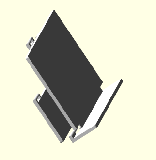
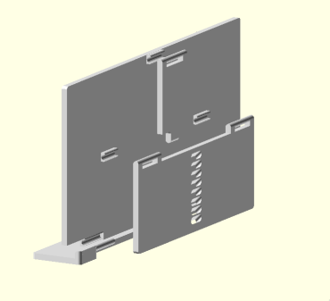

# Limbani

A foldable, parametric stand which can hold a variety of objects at adjustable
angles.

(These renders are not exact.)

This stand's default holding dimensions are 55mm by 142mm - big enough for a
smartphone. Don't let this stop you from adjust the parameters to generate new
types of stands!

## Customization

Open the `main.scad` file and edit the `stand_*` parameters.

In the rare case it may be necessary to edit the `config.scad` file to adjust
the extrusion height measurement.

## Building

Run `make` and each part is output to `stl/`. You can also open `main.scad` in
OpenSCAD and you'll see the full result.

NOTE: OpenCSG mode has a lot of "z-fighting", meaning you'll see a lot of
flicking faces. This is ok - when rendering, this is resolved.

## Printing

This model was built with a 0.2mm extrusion height and 0.4mm extrusion nozzle
in mind. Any higher and no guarantee this will print properly.

It's highly suggested to do a print test with the small clips, to be sure
measurements are correct. This will save you from printing the entire stand,
only to discover the parts do not clip together.

## Motivation

This was originally inspired by book stands and designed for creating a stand
for the Retroid Pocket 2 handheld gaming device.

## Acknowledgements

This project would not have been possible without the very generous help of
/u/modernjess of reddit.com.

## License

This work is licensed under the Creative Commons
Attribution-NonCommercial-ShareAlike 4.0 International License. To view a copy
of this license, visit http://creativecommons.org/licenses/by-nc-sa/4.0/ or send
a letter to Creative Commons, PO Box 1866, Mountain View, CA 94042, USA.
