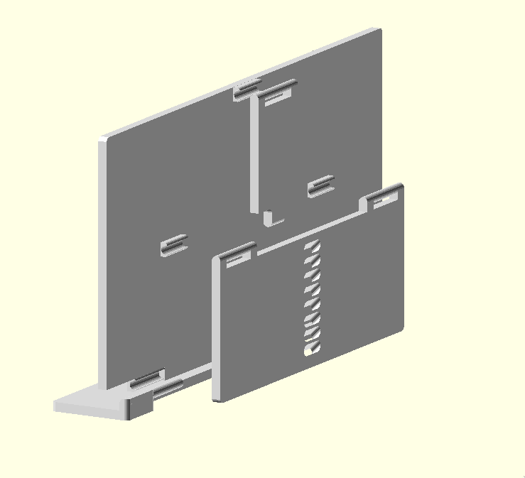

# Limbani

A foldable, parametric stand which can hold a variety of objects at adjustable
angles.

This stand's default holding dimensions are 70mm by 162mm - big enough for a
smartphone. Don't let this stop you from adjust the parameters to generate new
types of stands!

## Motivation

This was originally inspired by book stands and designed for creating a stand
for the Retroid Pocket 2 handheld gaming device.

## License

This work is licensed under the Creative Commons Attribution-ShareAlike 4.0
International License. To view a copy of this license, visit
http://creativecommons.org/licenses/by-sa/4.0/ or send a letter to Creative
Commons, PO Box 1866, Mountain View, CA 94042, USA.
